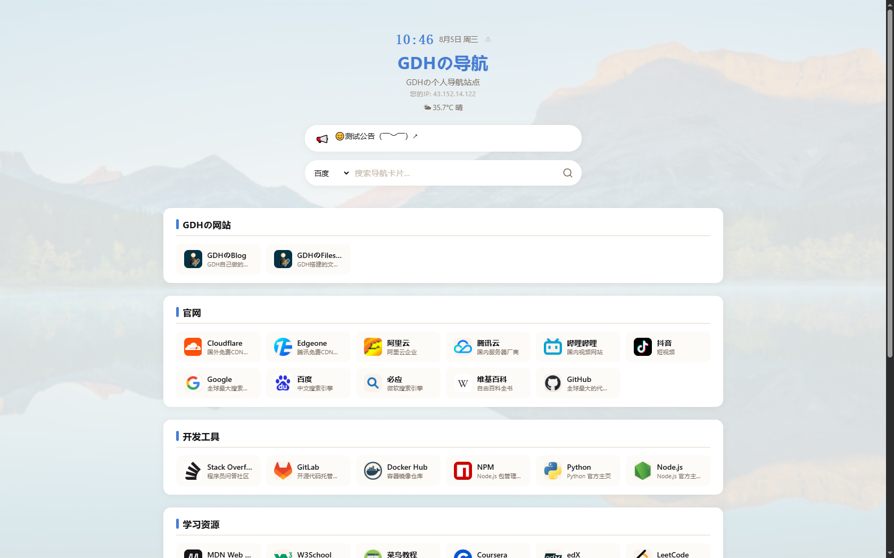
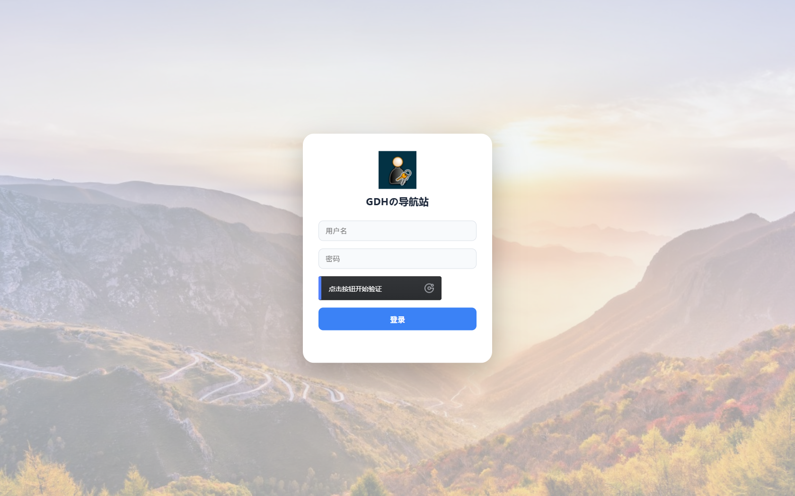
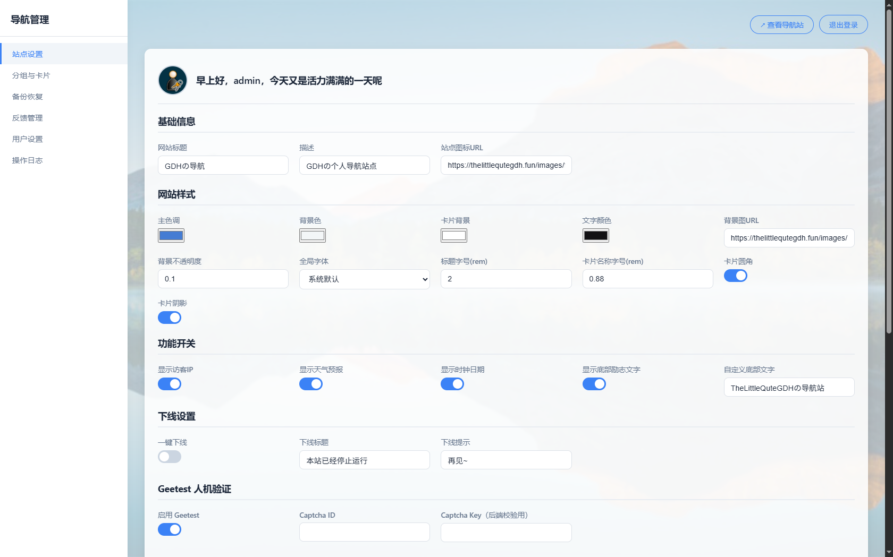

<div align="center">
 <a href="https://thelittlequtegdh.fun" target="_self">
    
 </a>
 <br>
  <p><strong><em>GDHの导航站</em></strong></p>
  本项目离不开豆包Ai与DeepSeek的帮助
</div>


------

### 导航站效果展示：可以查看演示站：[👉点我](https://thelittlequtegdh.fun)

前台index.html



后台Manage.html（登录页+后台设置）





### 导航站介绍：

本项目使用DeepSeek与豆包AI共同编写

- DeepSeek：负责网站的框架编写与网站设置逻辑编写
- 豆包AI：负责添加提交反馈弹窗+后台登陆页的Geetest人机验证以及卡片的有效性检测功能

本项目不依赖SQL数据库，所有后台数据全部存储在一个JSON文件里：data.json，文件内部存储网站后台的账号密码，后台设置的存储以及日志，公告等一系列数据。可以用于部署最基本的个人导航站，但我认为用于商业用途的话差很远，有提交反馈页面，能向管理员提交反馈，后台能收到。

本项目编写了简单的安全防护，如快捷键无法打开F12开发人员选项工具，简单的防XSS注入等，并配置了Geetest人机验证，防止机器人提交反馈请求过多导致反馈接口卡死。如果要配置Geetest人机验证请到官网获取ID和Key，如果不配置则默认隐藏人机验证

Geetest官网：[Geetest.Com](https://www.geetest.com)

本站后台设置功能...不能说丰富吧，只能说是把最基本的设置已经写出来了，主要有以下设置

样式：

- 调整网站的颜色（主色调，背景色，文字色，卡片色）
- 网站的全局字体，背景透明度，标题字号，卡片名字字号，卡片阴影，卡片圆角
- 网站的背景图

其他设置：

- 网站下线（标题+提示）
- 自定义网站标题，描述
- 访客IP，天气，日期时间，底部励志文字，自定义底部内容
- Geetest人机验证
- 添加，编辑，删除网站的分类以及卡片
- 卡片链接有效性检测（不完善）
- 备份JSON数据文件，导入JSON数据文件可以恢复之前的设置
- 用户反馈查看，但不能回复
- 用户设置（后台用户登录设置，能设置用户名，密码，用户图标）
- 查看日志


如果你不想设置后台，你可以直接修改data.JSON文件里面的值，文件的内容如下：（其中第一次访问manage.html会先运行api.php文件，并在根目录下生成默认的data.json文件，你可以直接按照提示修改即可）

```json
{
    "user": {
        "username": "admin",  //用户名
        "password": "$2y$10$d5BiuyzQ4fUhH.dx8gkNV.di.njXyZD7Xidfizu91jbwBo5i2aJwe",  //加密密码，默认密码为admin123
        "avatar": ""
    },
    "settings": {
        "title": "导航站",  //网站的标题
        "description": "导航站点",  //网站的描述
        "primaryColor": "#3b82f6",  //网站主色调
        "backgroundColor": "#f0f4f8",  //背景颜色
        "cardColor": "#ffffff",  //卡片的背景颜色
        "textColor": "#1e293b",  //文本颜色
        "icon": "",  //站点图标
        "backgroundImage": "",  //网站的背景图
        "backgroundOpacity": 0.29999999999999999,  //背景不透明度
        "showIP": false,  //是否展示访客IP（如果套了CDN只会显示节点IP）
        "offline": false,  //是否开启下线网站
        "offlineTitle": "网站暂时下线",  //网站下线时访客看到的标题
        "offlineMessage": "请稍后再来~",  //网站下线时访客看到的描述
        "noticeEnabled": false,  //是否启用网站公告栏
        "popupEnabled": false,  //是否启用网站弹窗公告
        "showWeather": false,  //是否显示天气
        "showClock": true,  //是否显示时间日期
        "showQuote": true,  //是否显示网站底部励志文字
        "footerText": "",  //自定义网站底部内容（如果开启了显示底部励志文字的话优先级最高）
        "cardRadius": true,  //是否开启卡片圆角
        "cardShadow": true,  //是否开启卡片阴影
        "globalFont": "",  //全局字体
        "titleFontSize": 2,  //标题字号(rem)
        "cardNameFontSize": 0.88,  //卡片名称字号(rem)
        "enableGeetest": false,  //是否开启网站Geetest人机验证（提交反馈+后台登录页面）
        "geetestId": "",  //这里填写你的Geetest的ID（如果启用）
        "geetestKey": ""  //这里填写你的Geetest的Key（如果启用）
    },
    "groups": [
        {
            "name": "测试链接",       //卡片分组名
            "cards": [                       //卡片
                {
                    "name": "百度",
                    "url": "https:\/\/www.baidu.com",
                    "description": "百度搜索引擎",
                    "icon": "https:\/\/www.baidu.com\/favicon.ico"
                },
                {
                    "name": "Bing",
                    "url": "https:\/\/cn.bing.com",
                    "description": "Bing搜索引擎",
                    "icon": "https:\/\/favicon.splitbee.io\/?url=https%3A%2F%2Fcn.bing.com"
                }
            ]
        }
    ],
    "notice": {          //网站的顶部公告栏公告
        "title": "",       //网站的顶部公告栏公告标题
        "icon": "",      //网站的顶部公告栏公告图标
        "content": ""  //网站的顶部公告栏公告内容
    },
    "popups": [         //网站的弹窗公告
        {
            "id": "pop_6a71ddcac270e4.77770490",  //公告弹窗ID
            "type": "notice",  //公告弹窗类型，notice或者welcome
            "title": "站点公告",  //公告弹窗标题
            "icon": "",  //公告弹窗图标
            "content": "Welcome！！",  //公告弹窗内容
            "strategy": "always",  //公告弹窗频率，always:经常弹出，daily:每天一次，weekly:每周一次
            "enabled": true  //是否启用弹窗公告，true or false
        }
    ],      
}
```

### 文件列表：

项目主要有以下文件：

根目录

- index.html-网站的主页面
- manage.html-后台管理页面（登录页+设置）
- checklinks.php-检查链接卡片的有效性（目前不成熟，会出现误报的情况）
- api.php-管理网站修改，主要核心，index.html通过api.php读取data.json，manage.html通过api.php将数据存储在data.json文件中
- about.md-前台底部“关于本站”所显示的内容

JS--与index.html和manage.html配套的脚本

- manage.js-manage.html配套脚本，管理后台的设置与登录逻辑
- index.js-index.html配套脚本，管理前台的日期时间，访客IP，天气情况，底部励志文字，自定义底部，读取data.JSON应用于全局设置

Images-网站的图片，这个不用说

CSS-网站的全局样式

- styles.css-index.html的Styles样式
- managestyles.css-manage.html的css样式

### 项目的不足

- 前面提到过的检查链接卡片的有效性（目前不成熟，会出现误报的情况），希望有大佬能修改以下
- 已尽力去除emoji图标，仍有残留。
- 网站使用AI编写，有些功能或者设置不完善或者出错

### 如何部署？

你可以查看本项目右侧的Releases下载Latest压缩包，将下载好的压缩包解压到你的域名的根目录即可，请注意，你的虚拟主机或其他面板需要支持根目录读写，否则无法存储和读取JSON数据，由于本站的核心是api.php，所以你的服务器/虚拟主机/宝塔面板需要支持运行PHP程序才可使用，本站不依赖数据库

提示：登录页的背景图找到css/manage.css下的`.login-bg {`的代码修改`background-image: url('你找到的网站背景图链接');`部分，
后台设置的背景图同样是在css/manage.css的`.main-content::before {`修改` background: url('你找到的网站背景图链接') center/cover no-repeat;`部分
登录页头像请在manage.html文件下，滑到最底部找到以下代码修改即可

```html
    <div id="loginBox">
        <div class="login-header">
            
            <h2>GDHの导航站</h2>
        </div>
        <div class="login-field"><input type="text" id="loginUser" placeholder="用户名" autocomplete="username"></div>
        <div class="login-field"><input type="password" id="loginPass" placeholder="密码" autocomplete="current-password"></div>
        <div id="loginCaptchaWrap" style="margin: 12px 0 16px; display:none;"><div id="loginCaptcha"></div></div>
        <button class="login-btn" id="loginBtn" onclick="login()">登录</button>
        <div id="loginMsg"></div>
    </div>
```

### 正在努力研究纯前端的导航站部署，等待...

### 
